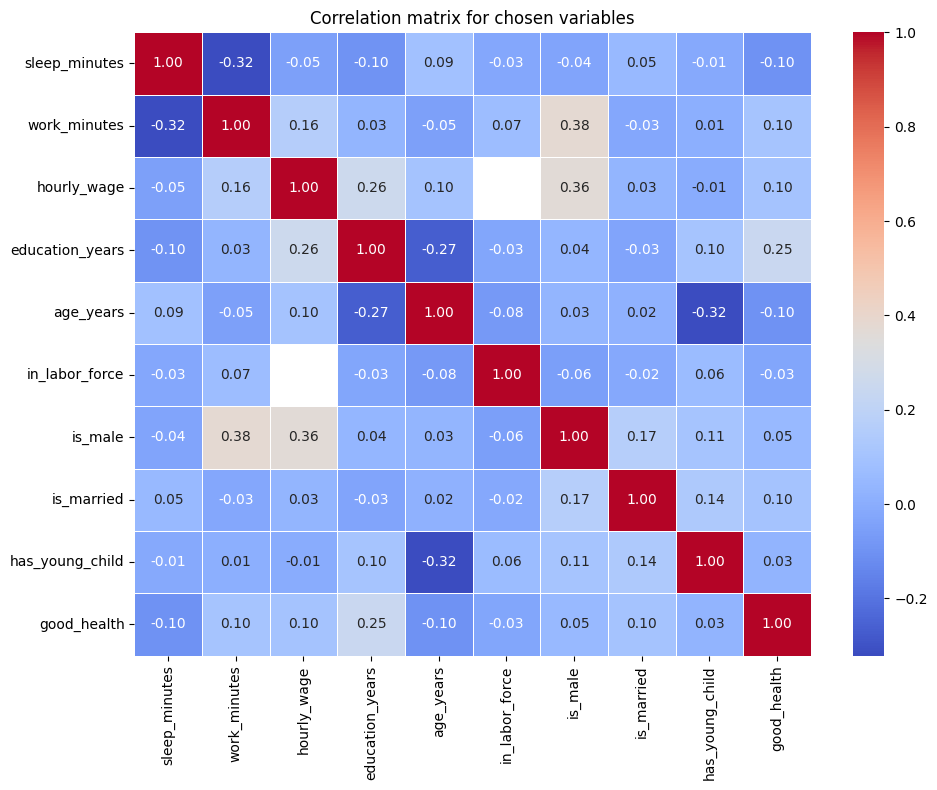
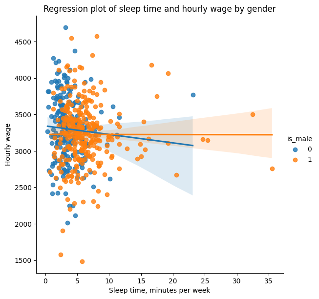
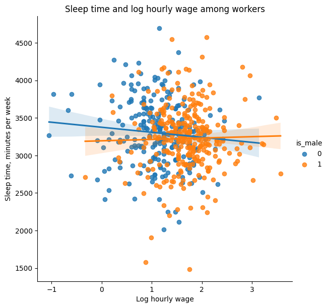
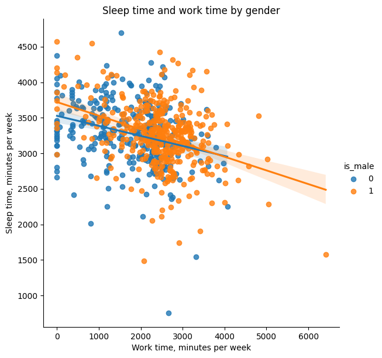

# This report concerns the relationship between sleep and the allocation of time.

- In their article, Biddle and Hamermesh study sleep as an economic choice affected primarly by work, wages, and individual characteristics.

- The key idea is that higher wage rates may reduce sleep time among men, because a higher wage increases the opportunity cost of time spent sleeping. However, the wage variable creates an econometric problem; it is missing for individuals who do not work and may also be endogenous.

- The aim of this report is to examine and estimate a statistical model for sleep time as well as the limitations caused by missing wage data and possible endogeneity.


```python
import pandas as pd
import numpy as np
import seaborn as sns
import matplotlib.pyplot as plt
import statsmodels.api as sm
import statsmodels.formula.api as smf
```


```python
column_names = [
    "age_years",
    "is_black",
    "case_id",
    "is_clerical_worker",
    "is_construction_worker",
    "education_years",
    "earnings_1974",
    "good_health",
    "in_labor_force",
    "leisure_excl_naps",
    "leisure_incl_naps",
    "leisure_relaxation",
    "lives_in_smsa",
    "log_hourly_wage",
    "log_other_income",
    "is_male",
    "is_married",
    "is_protestant",
    "relaxation_total",
    "is_self_employed",
    "sleep_minutes",
    "sleep_naps_minutes",
    "lives_in_south",
    "spouse_wage_income",
    "spouse_works",
    "work_minutes",
    "union_member",
    "main_job_minutes",
    "second_job_minutes",
    "experience_years",
    "has_young_child",
    "years_married",
    "hourly_wage",
    "age_squared",
]

# note: I'm using modified column names, not the exact names from the dataset description file, for improved readability

df = pd.read_excel("sleep75.xls", header=None, names=column_names, na_values=".")


print(df.head(5))
print(df.shape)
print(df.info())
print(df.describe())
```

       age_years  is_black  case_id  is_clerical_worker  is_construction_worker  \
    0         32         0        1                 0.0                     0.0   
    1         31         0        2                 0.0                     0.0   
    2         44         0        3                 0.0                     0.0   
    3         30         0        4                 0.0                     0.0   
    4         64         0        5                 0.0                     0.0   
    
       education_years  earnings_1974  good_health  in_labor_force  \
    0               12              0            0               1   
    1               14           9500            1               1   
    2               17          42500            1               1   
    3               12          42500            1               1   
    4               14           2500            1               1   
    
       leisure_excl_naps  ...  spouse_works  work_minutes  union_member  \
    0               3529  ...             0          3438             0   
    1               2140  ...             0          5020             0   
    2               4595  ...             1          2815             0   
    3               3211  ...             1          3786             0   
    4               4052  ...             1          2580             0   
    
       main_job_minutes  second_job_minutes  experience_years  has_young_child  \
    0              3438                   0                14                0   
    1              5020                   0                11                0   
    2              2815                   0                21                0   
    3              3786                   0                12                0   
    4              2580                   0                44                0   
    
       years_married  hourly_wage  age_squared  
    0             13     7.070004         1024  
    1              0     1.429999          961  
    2              0    20.530000         1936  
    3             12     9.619998          900  
    4             33     2.750000         4096  
    
    [5 rows x 34 columns]
    (706, 34)
    <class 'pandas.DataFrame'>
    RangeIndex: 706 entries, 0 to 705
    Data columns (total 34 columns):
     #   Column                  Non-Null Count  Dtype  
    ---  ------                  --------------  -----  
     0   age_years               706 non-null    int64  
     1   is_black                706 non-null    int64  
     2   case_id                 706 non-null    int64  
     3   is_clerical_worker      706 non-null    float64
     4   is_construction_worker  706 non-null    float64
     5   education_years         706 non-null    int64  
     6   earnings_1974           706 non-null    int64  
     7   good_health             706 non-null    int64  
     8   in_labor_force          706 non-null    int64  
     9   leisure_excl_naps       706 non-null    int64  
     10  leisure_incl_naps       706 non-null    int64  
     11  leisure_relaxation      706 non-null    int64  
     12  lives_in_smsa           706 non-null    int64  
     13  log_hourly_wage         532 non-null    float64
     14  log_other_income        706 non-null    float64
     15  is_male                 706 non-null    int64  
     16  is_married              706 non-null    int64  
     17  is_protestant           706 non-null    int64  
     18  relaxation_total        706 non-null    int64  
     19  is_self_employed        706 non-null    int64  
     20  sleep_minutes           706 non-null    int64  
     21  sleep_naps_minutes      706 non-null    int64  
     22  lives_in_south          706 non-null    int64  
     23  spouse_wage_income      706 non-null    int64  
     24  spouse_works            706 non-null    int64  
     25  work_minutes            706 non-null    int64  
     26  union_member            706 non-null    int64  
     27  main_job_minutes        706 non-null    int64  
     28  second_job_minutes      706 non-null    int64  
     29  experience_years        706 non-null    int64  
     30  has_young_child         706 non-null    int64  
     31  years_married           706 non-null    int64  
     32  hourly_wage             532 non-null    float64
     33  age_squared             706 non-null    int64  
    dtypes: float64(5), int64(29)
    memory usage: 187.7 KB
    None
            age_years    is_black     case_id  is_clerical_worker  \
    count  706.000000  706.000000  706.000000          706.000000   
    mean    38.815864    0.049575  353.500000            0.182331   
    std     11.342637    0.217219  203.948932            0.335413   
    min     23.000000    0.000000    1.000000            0.000000   
    25%     29.000000    0.000000  177.250000            0.000000   
    50%     36.000000    0.000000  353.500000            0.000000   
    75%     48.000000    0.000000  529.750000            0.182331   
    max     65.000000    1.000000  706.000000            1.000000   
    
           is_construction_worker  education_years  earnings_1974  good_health  \
    count              706.000000       706.000000     706.000000   706.000000   
    mean                 0.030075        12.780453    9767.705382     0.890935   
    std                  0.148366         2.784702    9323.588151     0.311942   
    min                  0.000000         1.000000       0.000000     0.000000   
    25%                  0.000000        12.000000    2500.000000     1.000000   
    50%                  0.000000        12.000000    8250.000000     1.000000   
    75%                  0.030075        16.000000   13750.000000     1.000000   
    max                  1.000000        17.000000   42500.000000     1.000000   
    
           in_labor_force  leisure_excl_naps  ...  spouse_works  work_minutes  \
    count      706.000000         706.000000  ...    706.000000    706.000000   
    mean         0.753541        4690.723796  ...      0.480170   2122.920680   
    std          0.431254         908.049561  ...      0.499961    947.470123   
    min          0.000000        1745.000000  ...      0.000000      0.000000   
    25%          1.000000        4109.750000  ...      0.000000   1553.500000   
    50%          1.000000        4620.000000  ...      0.000000   2288.000000   
    75%          1.000000        5203.750000  ...      1.000000   2691.750000   
    max          1.000000        7417.000000  ...      1.000000   6415.000000   
    
           union_member  main_job_minutes  second_job_minutes  experience_years  \
    count    706.000000        706.000000          706.000000        706.000000   
    mean       0.218130       2093.252125           29.668555         20.035411   
    std        0.413269        945.301457          148.834262         12.377520   
    min        0.000000          0.000000            0.000000          0.000000   
    25%        0.000000       1538.000000            0.000000         10.000000   
    50%        0.000000       2275.000000            0.000000         17.000000   
    75%        0.000000       2635.500000            0.000000         30.000000   
    max        1.000000       6415.000000         1337.000000         55.000000   
    
           has_young_child  years_married  hourly_wage  age_squared  
    count       706.000000     706.000000   532.000000   706.000000  
    mean          0.128895      11.769122     5.082839  1635.144476  
    std           0.335321      11.591227     3.704385   950.102976  
    min           0.000000       0.000000     0.350000   529.000000  
    25%           0.000000       0.000000     2.890002   841.000000  
    50%           0.000000       9.000000     4.380000  1296.000000  
    75%           0.000000      20.000000     6.210001  2304.000000  
    max           1.000000      43.000000    35.509990  4225.000000  
    
    [8 rows x 34 columns]


```python
print(df.isna().sum())

print(df["hourly_wage"].isna().sum())

print(df[df["in_labor_force"] == 0].isna().sum().sum() / 2)

# This is a check for IF the missing values are for sure only happening in people not in the labor force.
```

    age_years                   0
    is_black                    0
    case_id                     0
    is_clerical_worker          0
    is_construction_worker      0
    education_years             0
    earnings_1974               0
    good_health                 0
    in_labor_force              0
    leisure_excl_naps           0
    leisure_incl_naps           0
    leisure_relaxation          0
    lives_in_smsa               0
    log_hourly_wage           174
    log_other_income            0
    is_male                     0
    is_married                  0
    is_protestant               0
    relaxation_total            0
    is_self_employed            0
    sleep_minutes               0
    sleep_naps_minutes          0
    lives_in_south              0
    spouse_wage_income          0
    spouse_works                0
    work_minutes                0
    union_member                0
    main_job_minutes            0
    second_job_minutes          0
    experience_years            0
    has_young_child             0
    years_married               0
    hourly_wage               174
    age_squared                 0
    dtype: int64
    174
    174.0


Overall, we can observe as much as 174 missing values all concerning hourly wages.

This will be our main concern in modelling this dataset, because wage is not missing at random.

The missing values are **only** spread among individuals who are not in the labor force.

This confirms that wage missingness is missing **not** at random

Hence, I decide not use simple median imputation for wage, for the reason that data is missing for a systematic economic reason, not because of random measurement failure. 

Imputing the average or median wage for nonworkers would create artificial wage values and would blur the distinction between workers and nonworkers.

Therefore, dropping all observations with missing wage would remove nonworkers from the sample and change the analysis from the full population to labor force participants only.

For this reason, I'm going to use two separate models;

The main model will be estimated on the full sample and will exclude wage, while including an indicator for labor-force participation.

The second model will be estimated only for individuals in the labor force and will include hourly wage (or its logarithm).
This model will be treated as a secondary specification, useful for examining the wage and sleep relationship among workers only.

Though I'm obliged to mention that its results will not describe the full sample.

# First, manual analysis of the dataset


```python
main_vars = [
    "sleep_minutes",
    "work_minutes",
    "hourly_wage",
    "education_years",
    "age_years",
    "in_labor_force",
    "is_male",
    "is_married",
    "has_young_child",
    "good_health",
]

# these variables have been chosen by hand to serve for some introductory analysis

corr_matrix = df[main_vars].corr(numeric_only=True)

plt.figure(figsize=(10, 8))
sns.heatmap(corr_matrix, annot=True, fmt=".2f", cmap="coolwarm", linewidths=0.5)
plt.title("Correlation matrix for chosen variables")
plt.tight_layout()
plt.show()
```


    

    


At first, moderate negative correlaton can be observed between sleep time in minutes and work time in minutes. This could possibly be worth looking into, as it might explain the opportunity cost between working and sleeping.

Next up, having a child as well as education are negatively correlated with age. This seems to be rather self explanatory as a social phenomenon.

When it comes to positive correlation, being a male has a mild positive correlation with both work time in minutes and hourly wage. I would find a source of this correlaton in the socio-economic circumstances of the year this sample was gathered in. This may reflect the socio-economic circumstances of the 1975 sample, when male labor-force participation and earnings were often higher due to traditional household roles and gender inequality in the labor market.

Another positive correlation is education in years to hourly wage, this might be supported by the overall idea that higher educated people tend to earn slightly more.

For the purpose of this report, the correlation analysis will be treated as an exploratory step rather than as formal evidence of causality. The observed correlations help identify relationships that are worth investigating further, especially the negative relationship between work time and sleep time. However, correlation does not control for other factors and does not account for the structural missingness of wages.

Therefore, the next step is to estimate regression models that control for several variables at once. First, a simple two-variable model will be estimated to examine the basic relationship between work time and sleep time.


```python
sns.lmplot(
    data=df,
    x="hourly_wage",
    y="sleep_minutes",
    hue="is_male",
    height=6,
)

plt.title("Regression plot of sleep time and hourly wage by gender")
plt.xlabel("Sleep time, minutes per week")
plt.ylabel("Hourly wage")
plt.show()
```


    

    


1. The relationship between sleep time and hourly wage seems weak and the regression line is almost flat for men.

2. For woman, the line is slightly negative, which means that higher sleep time is mildly correlated with the hourly wage.

3. A clear gender wage difference can be observed, which is supported by earlier observation.

4. High-wage outliers are present, which might suggest that a transformation could be useful.


```python
workers_only = df[df["in_labor_force"] == 1].copy()

sns.lmplot(
    data=workers_only,
    x="log_hourly_wage",
    y="sleep_minutes",
    hue="is_male",
    height=6,
)

plt.title("Sleep time and log hourly wage among workers")
plt.xlabel("Log hourly wage")
plt.ylabel("Sleep time, minutes per week")
plt.show()
```


    

    


The points are widely scattered, which suggests that wage alone can only explain very little of the variation in sleep time.

Most workers sleep somewhere around 3,000–3,600 minutes per week, regardless of wage level.


```python
sns.lmplot(
    data=df,
    x="work_minutes",
    y="sleep_minutes",
    hue="is_male",
    height=6,
)

plt.title("Sleep time and work time by gender")
plt.xlabel("Work time, minutes per week")
plt.ylabel("Sleep time, minutes per week")
plt.show()
```


    

    


The plot for sleep time and work time shows a clear negative relationship between weekly work time and weekly sleep time. People who work more minutes per week naturally tend to sleep less, which is a notable tradeoff.

This pattern is visible for both men and women, although men are more concentrated at higher levels of work time. Compared with the wage plot, work time appears to have a much stronger relationship with sleep, so it should be a key variable in the regression models.


```python
simple_model = smf.ols("sleep_minutes ~ work_minutes", data=df).fit(cov_type="HC1")

print(simple_model.summary())
```

                                OLS Regression Results                            
    ==============================================================================
    Dep. Variable:          sleep_minutes   R-squared:                       0.103
    Model:                            OLS   Adj. R-squared:                  0.102
    Method:                 Least Squares   F-statistic:                     65.69
    Date:                Sun, 14 Jun 2026   Prob (F-statistic):           2.34e-15
    Time:                        22:39:35   Log-Likelihood:                -5267.1
    No. Observations:                 706   AIC:                         1.054e+04
    Df Residuals:                     704   BIC:                         1.055e+04
    Df Model:                           1                                         
    Covariance Type:                  HC1                                         
    ================================================================================
                       coef    std err          z      P>|z|      [0.025      0.975]
    --------------------------------------------------------------------------------
    Intercept     3586.3770     41.982     85.427      0.000    3504.095    3668.659
    work_minutes    -0.1507      0.019     -8.105      0.000      -0.187      -0.114
    ==============================================================================
    Omnibus:                       68.651   Durbin-Watson:                   1.955
    Prob(Omnibus):                  0.000   Jarque-Bera (JB):              192.044
    Skew:                          -0.483   Prob(JB):                     1.99e-42
    Kurtosis:                       5.365   Cond. No.                     5.71e+03
    ==============================================================================
    
    Notes:
    [1] Standard Errors are heteroscedasticity robust (HC1)
    [2] The condition number is large, 5.71e+03. This might indicate that there are
    strong multicollinearity or other numerical problems.


This simple regression model shows a statistically significant negative relationship between weekly work time and weekly sleep time. The estimated cofficient of `work_minutes` is -0.1507, meaning that one additional minute of work per week is associated with about 0.15 less minutes of sleep per week. (For one additinal hour of work per week it is about 9 less minutes of sleep.)


$60 \times (-0.1507) \approx -9.04$


The coefficient is statistically significant, suggesting that the negative relationship observed in the exploratory plot is also present in the regression model. However, the R-squared is 0.103, meaning that the work time alone is able to explain just about 10.3% of the variation in sleep time. Therefore, this model might be useful as a benchmark but is too simple and leaves a almost 90% of the dependancy a mystery.

---

Now, time for a model with our theory-selected subset of variables.


```python
model_full = smf.ols(
    "sleep_minutes ~ work_minutes + education_years + age_years + age_squared + "
    "is_male + is_married + has_young_child + good_health + in_labor_force",
    data=df
).fit(cov_type="HC1")

print(model_full.summary())
```

                                OLS Regression Results                            
    ==============================================================================
    Dep. Variable:          sleep_minutes   R-squared:                       0.126
    Model:                            OLS   Adj. R-squared:                  0.115
    Method:                 Least Squares   F-statistic:                     9.869
    Date:                Sun, 14 Jun 2026   Prob (F-statistic):           2.57e-14
    Time:                        22:47:12   Log-Likelihood:                -5258.1
    No. Observations:                 706   AIC:                         1.054e+04
    Df Residuals:                     696   BIC:                         1.058e+04
    Df Model:                           9                                         
    Covariance Type:                  HC1                                         
    ===================================================================================
                          coef    std err          z      P>|z|      [0.025      0.975]
    -----------------------------------------------------------------------------------
    Intercept        3818.4766    268.356     14.229      0.000    3292.509    4344.444
    work_minutes       -0.1602      0.021     -7.589      0.000      -0.202      -0.119
    education_years    -9.5754      5.906     -1.621      0.105     -21.150       2.000
    age_years          -7.4511     11.842     -0.629      0.529     -30.660      15.758
    age_squared         0.1120      0.137      0.817      0.414      -0.157       0.381
    is_male            82.6210     36.336      2.274      0.023      11.405     153.837
    is_married         40.4538     45.217      0.895      0.371     -48.169     129.077
    has_young_child    -6.6099     54.154     -0.122      0.903    -112.749      99.529
    good_health       -72.8485     58.128     -1.253      0.210    -186.776      41.079
    in_labor_force      2.7403     39.638      0.069      0.945     -74.949      80.430
    ==============================================================================
    Omnibus:                       67.162   Durbin-Watson:                   1.940
    Prob(Omnibus):                  0.000   Jarque-Bera (JB):              182.914
    Skew:                          -0.481   Prob(JB):                     1.91e-40
    Kurtosis:                       5.301   Cond. No.                     4.37e+04
    ==============================================================================
    
    Notes:
    [1] Standard Errors are heteroscedasticity robust (HC1)
    [2] The condition number is large, 4.37e+04. This might indicate that there are
    strong multicollinearity or other numerical problems.


This model seems ...
