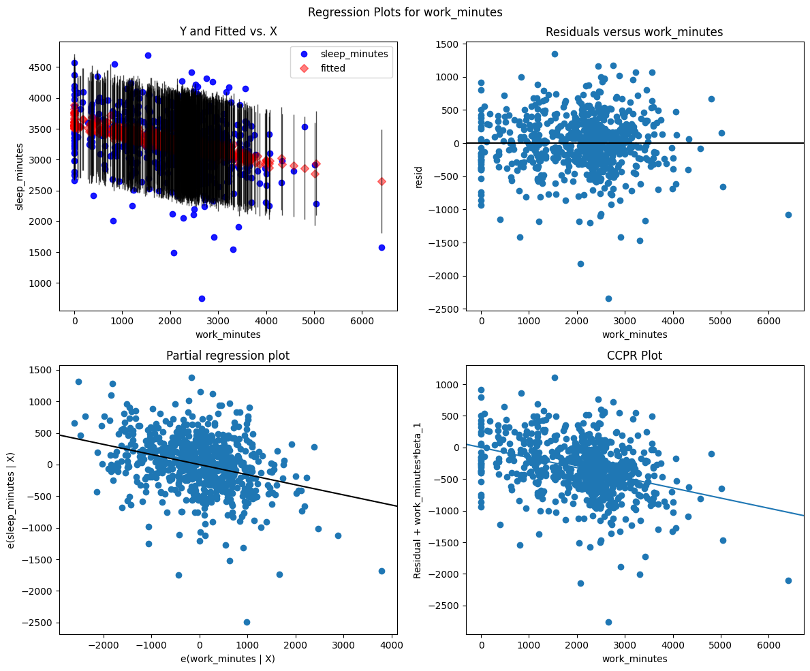
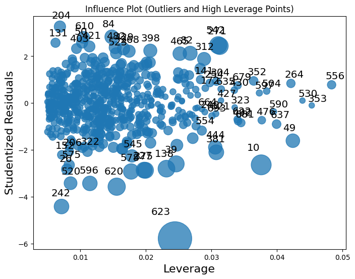
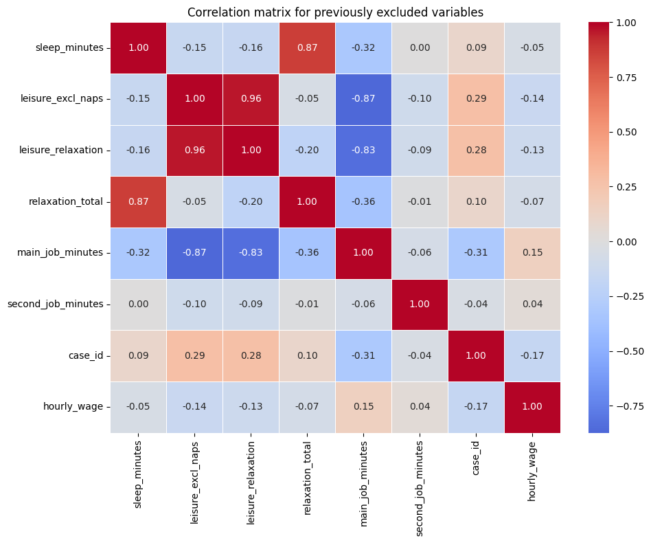

# This report concerns the relationship between sleep and the allocation of time.

- In their article, Biddle and Hamermesh study sleep as an economic choice affected primarly by work, wages, and individual characteristics.

- The key idea is that higher wage rates may reduce sleep time among men, because a higher wage increases the opportunity cost of time spent sleeping. However, the wage variable creates an econometric problem; it is missing for individuals who do not work and may also be endogenous.

- The aim of this report is to examine and estimate a statistical model for sleep time as well as the limitations caused by missing wage data and possible endogeneity.


```python
import pandas as pd
import numpy as np
import seaborn as sns
import matplotlib.pyplot as plt
import statsmodels.api as sm
import statsmodels.formula.api as smf
```


```python
column_names = [
    "age_years",
    "is_black",
    "case_id",
    "is_clerical_worker",
    "is_construction_worker",
    "education_years",
    "earnings_1974",
    "good_health",
    "in_labor_force",
    "leisure_excl_naps",
    "leisure_incl_naps",
    "leisure_relaxation",
    "lives_in_smsa",
    "log_hourly_wage",
    "log_other_income",
    "is_male",
    "is_married",
    "is_protestant",
    "relaxation_total",
    "is_self_employed",
    "sleep_minutes",
    "sleep_naps_minutes",
    "lives_in_south",
    "spouse_wage_income",
    "spouse_works",
    "work_minutes",
    "union_member",
    "main_job_minutes",
    "second_job_minutes",
    "experience_years",
    "has_young_child",
    "years_married",
    "hourly_wage",
    "age_squared",
]

# note: I'm using modified column names, not the exact names from the dataset description file, for improved readability

df = pd.read_excel("sleep75.xls", header=None, names=column_names, na_values=".")


print(df.head(5))
print(df.shape)
print(df.info())
print(df.describe())
```

       age_years  is_black  case_id  is_clerical_worker  is_construction_worker  \
    0         32         0        1                 0.0                     0.0   
    1         31         0        2                 0.0                     0.0   
    2         44         0        3                 0.0                     0.0   
    3         30         0        4                 0.0                     0.0   
    4         64         0        5                 0.0                     0.0   
    
       education_years  earnings_1974  good_health  in_labor_force  \
    0               12              0            0               1   
    1               14           9500            1               1   
    2               17          42500            1               1   
    3               12          42500            1               1   
    4               14           2500            1               1   
    
       leisure_excl_naps  ...  spouse_works  work_minutes  union_member  \
    0               3529  ...             0          3438             0   
    1               2140  ...             0          5020             0   
    2               4595  ...             1          2815             0   
    3               3211  ...             1          3786             0   
    4               4052  ...             1          2580             0   
    
       main_job_minutes  second_job_minutes  experience_years  has_young_child  \
    0              3438                   0                14                0   
    1              5020                   0                11                0   
    2              2815                   0                21                0   
    3              3786                   0                12                0   
    4              2580                   0                44                0   
    
       years_married  hourly_wage  age_squared  
    0             13     7.070004         1024  
    1              0     1.429999          961  
    2              0    20.530000         1936  
    3             12     9.619998          900  
    4             33     2.750000         4096  
    
    [5 rows x 34 columns]
    (706, 34)
    <class 'pandas.DataFrame'>
    RangeIndex: 706 entries, 0 to 705
    Data columns (total 34 columns):
     #   Column                  Non-Null Count  Dtype  
    ---  ------                  --------------  -----  
     0   age_years               706 non-null    int64  
     1   is_black                706 non-null    int64  
     2   case_id                 706 non-null    int64  
     3   is_clerical_worker      706 non-null    float64
     4   is_construction_worker  706 non-null    float64
     5   education_years         706 non-null    int64  
     6   earnings_1974           706 non-null    int64  
     7   good_health             706 non-null    int64  
     8   in_labor_force          706 non-null    int64  
     9   leisure_excl_naps       706 non-null    int64  
     10  leisure_incl_naps       706 non-null    int64  
     11  leisure_relaxation      706 non-null    int64  
     12  lives_in_smsa           706 non-null    int64  
     13  log_hourly_wage         532 non-null    float64
     14  log_other_income        706 non-null    float64
     15  is_male                 706 non-null    int64  
     16  is_married              706 non-null    int64  
     17  is_protestant           706 non-null    int64  
     18  relaxation_total        706 non-null    int64  
     19  is_self_employed        706 non-null    int64  
     20  sleep_minutes           706 non-null    int64  
     21  sleep_naps_minutes      706 non-null    int64  
     22  lives_in_south          706 non-null    int64  
     23  spouse_wage_income      706 non-null    int64  
     24  spouse_works            706 non-null    int64  
     25  work_minutes            706 non-null    int64  
     26  union_member            706 non-null    int64  
     27  main_job_minutes        706 non-null    int64  
     28  second_job_minutes      706 non-null    int64  
     29  experience_years        706 non-null    int64  
     30  has_young_child         706 non-null    int64  
     31  years_married           706 non-null    int64  
     32  hourly_wage             532 non-null    float64
     33  age_squared             706 non-null    int64  
    dtypes: float64(5), int64(29)
    memory usage: 187.7 KB
    None
            age_years    is_black     case_id  is_clerical_worker  \
    count  706.000000  706.000000  706.000000          706.000000   
    mean    38.815864    0.049575  353.500000            0.182331   
    std     11.342637    0.217219  203.948932            0.335413   
    min     23.000000    0.000000    1.000000            0.000000   
    25%     29.000000    0.000000  177.250000            0.000000   
    50%     36.000000    0.000000  353.500000            0.000000   
    75%     48.000000    0.000000  529.750000            0.182331   
    max     65.000000    1.000000  706.000000            1.000000   
    
           is_construction_worker  education_years  earnings_1974  good_health  \
    count              706.000000       706.000000     706.000000   706.000000   
    mean                 0.030075        12.780453    9767.705382     0.890935   
    std                  0.148366         2.784702    9323.588151     0.311942   
    min                  0.000000         1.000000       0.000000     0.000000   
    25%                  0.000000        12.000000    2500.000000     1.000000   
    50%                  0.000000        12.000000    8250.000000     1.000000   
    75%                  0.030075        16.000000   13750.000000     1.000000   
    max                  1.000000        17.000000   42500.000000     1.000000   
    
           in_labor_force  leisure_excl_naps  ...  spouse_works  work_minutes  \
    count      706.000000         706.000000  ...    706.000000    706.000000   
    mean         0.753541        4690.723796  ...      0.480170   2122.920680   
    std          0.431254         908.049561  ...      0.499961    947.470123   
    min          0.000000        1745.000000  ...      0.000000      0.000000   
    25%          1.000000        4109.750000  ...      0.000000   1553.500000   
    50%          1.000000        4620.000000  ...      0.000000   2288.000000   
    75%          1.000000        5203.750000  ...      1.000000   2691.750000   
    max          1.000000        7417.000000  ...      1.000000   6415.000000   
    
           union_member  main_job_minutes  second_job_minutes  experience_years  \
    count    706.000000        706.000000          706.000000        706.000000   
    mean       0.218130       2093.252125           29.668555         20.035411   
    std        0.413269        945.301457          148.834262         12.377520   
    min        0.000000          0.000000            0.000000          0.000000   
    25%        0.000000       1538.000000            0.000000         10.000000   
    50%        0.000000       2275.000000            0.000000         17.000000   
    75%        0.000000       2635.500000            0.000000         30.000000   
    max        1.000000       6415.000000         1337.000000         55.000000   
    
           has_young_child  years_married  hourly_wage  age_squared  
    count       706.000000     706.000000   532.000000   706.000000  
    mean          0.128895      11.769122     5.082839  1635.144476  
    std           0.335321      11.591227     3.704385   950.102976  
    min           0.000000       0.000000     0.350000   529.000000  
    25%           0.000000       0.000000     2.890002   841.000000  
    50%           0.000000       9.000000     4.380000  1296.000000  
    75%           0.000000      20.000000     6.210001  2304.000000  
    max           1.000000      43.000000    35.509990  4225.000000  
    
    [8 rows x 34 columns]


```python
print(df.isna().sum())

print(df["hourly_wage"].isna().sum())

print(df[df["in_labor_force"] == 0].isna().sum().sum() / 2)

# This is a check for IF the missing values are for sure only happening in people not in the labor force.
```

    age_years                   0
    is_black                    0
    case_id                     0
    is_clerical_worker          0
    is_construction_worker      0
    education_years             0
    earnings_1974               0
    good_health                 0
    in_labor_force              0
    leisure_excl_naps           0
    leisure_incl_naps           0
    leisure_relaxation          0
    lives_in_smsa               0
    log_hourly_wage           174
    log_other_income            0
    is_male                     0
    is_married                  0
    is_protestant               0
    relaxation_total            0
    is_self_employed            0
    sleep_minutes               0
    sleep_naps_minutes          0
    lives_in_south              0
    spouse_wage_income          0
    spouse_works                0
    work_minutes                0
    union_member                0
    main_job_minutes            0
    second_job_minutes          0
    experience_years            0
    has_young_child             0
    years_married               0
    hourly_wage               174
    age_squared                 0
    dtype: int64
    174
    174.0


Overall, we can observe as much as 174 missing values all concerning hourly wages.

This will be our main concern in modelling this dataset, because wage is not missing at random.

The missing values are **only** spread among individuals who are not in the labor force.

This confirms that wage missingness is missing **not** at random (its structurally missing).

Hence, I decide not use simple median imputation for wage, for the reason that data is missing for a systematic economic reason, not because of random measurement failure. 

Imputing the average or median wage for nonworkers would create artificial wage values and would blur the distinction between workers and nonworkers.

Therefore, dropping all observations with missing wage would remove nonworkers from the sample and change the analysis from the full population to labor force participants only.

For this reason, I'm going to use two separate models;

The main model will be estimated on the full sample and will exclude wage, while including an indicator for labor-force participation.

The second model will be estimated only for individuals in the labor force and will include hourly wage (or its logarithm).
This model will be treated as a secondary specification, useful for examining the wage and sleep relationship among workers only.

Though I'm obliged to mention that its results will not describe the full sample.

# First, manual analysis of the dataset


```python
main_vars = [
    "sleep_minutes",
    "work_minutes",
    "hourly_wage",
    "education_years",
    "age_years",
    "in_labor_force",
    "is_male",
    "is_married",
    "has_young_child",
    "good_health",
]

# these variables have been chosen by hand to serve for some introductory analysis

corr_matrix = df[main_vars].corr(numeric_only=True)

plt.figure(figsize=(10, 8))
sns.heatmap(corr_matrix, annot=True, fmt=".2f", cmap="coolwarm", linewidths=0.5)
plt.title("Correlation matrix for chosen variables")
plt.tight_layout()
plt.show()
```


    

    


At first, moderate negative correlaton can be observed between sleep time in minutes and work time in minutes. This could possibly be worth looking into, as it might explain the opportunity cost between working and sleeping.

Next up, having a child as well as education are negatively correlated with age. This seems to be rather self explanatory as a social phenomenon.

When it comes to positive correlation, being a male has a mild positive correlation with both work time in minutes and hourly wage. I would find a source of this correlaton in the socio-economic circumstances of the year this sample was gathered in. This may reflect the socio-economic circumstances of the 1975 sample, when male labor-force participation and earnings were often higher due to traditional household roles and gender inequality in the labor market.

Another positive correlation is education in years to hourly wage, this might be supported by the overall idea that higher educated people tend to earn slightly more.

For the purpose of this report, the correlation analysis will be treated as an exploratory step rather than as formal evidence of causality. The observed correlations help identify relationships that are worth investigating further, especially the negative relationship between work time and sleep time. However, correlation does not control for other factors and does not account for the structural missingness of wages.

Therefore, the next step is to estimate regression models that control for several variables at once. First, a simple two-variable model will be estimated to examine the basic relationship between work time and sleep time.


```python
sns.lmplot(
    data=df,
    x="hourly_wage",
    y="sleep_minutes",
    hue="is_male",
    height=6,
)

plt.title("Regression plot of sleep time and hourly wage by gender")
plt.ylabel("Sleep time, minutes per week")
plt.xlabel("Hourly wage")
plt.show()
```


    

    


1. The relationship between sleep time and hourly wage seems weak and the regression line is almost flat for men.

2. For woman, the line is slightly negative, which means that higher sleep time is mildly correlated with the hourly wage.

3. A clear gender wage difference can be observed, which is supported by earlier observation.

4. High-wage outliers are present, which might suggest that a transformation could be useful.


```python
workers_only = df[df["in_labor_force"] == 1].copy()

sns.lmplot(
    data=workers_only,
    x="log_hourly_wage",
    y="sleep_minutes",
    hue="is_male",
    height=6,
)

plt.title("Sleep time and log hourly wage among workers")
plt.xlabel("Log hourly wage")
plt.ylabel("Sleep time, minutes per week")
plt.show()
```


    

    


The points are widely scattered, which suggests that wage alone can only explain very little of the variation in sleep time.

Most workers sleep somewhere around 3,000–3,600 minutes per week, regardless of wage level.


```python
sns.lmplot(
    data=df,
    x="work_minutes",
    y="sleep_minutes",
    hue="is_male",
    height=6,
)

plt.title("Sleep time and work time by gender")
plt.xlabel("Work time, minutes per week")
plt.ylabel("Sleep time, minutes per week")
plt.show()
```


    

    


The plot for sleep time and work time shows a clear negative relationship between weekly work time and weekly sleep time. People who work more minutes per week naturally tend to sleep less, which is a notable tradeoff.

This pattern is visible for both men and women, although men are more concentrated at higher levels of work time. Compared with the wage plot, work time appears to have a much stronger relationship with sleep, so it should be a key variable in the regression models.


```python
simple_model = smf.ols("sleep_minutes ~ work_minutes", data=df).fit(cov_type="HC1")

print(simple_model.summary())
```

                                OLS Regression Results                            
    ==============================================================================
    Dep. Variable:          sleep_minutes   R-squared:                       0.103
    Model:                            OLS   Adj. R-squared:                  0.102
    Method:                 Least Squares   F-statistic:                     65.69
    Date:                Sun, 14 Jun 2026   Prob (F-statistic):           2.34e-15
    Time:                        23:51:17   Log-Likelihood:                -5267.1
    No. Observations:                 706   AIC:                         1.054e+04
    Df Residuals:                     704   BIC:                         1.055e+04
    Df Model:                           1                                         
    Covariance Type:                  HC1                                         
    ================================================================================
                       coef    std err          z      P>|z|      [0.025      0.975]
    --------------------------------------------------------------------------------
    Intercept     3586.3770     41.982     85.427      0.000    3504.095    3668.659
    work_minutes    -0.1507      0.019     -8.105      0.000      -0.187      -0.114
    ==============================================================================
    Omnibus:                       68.651   Durbin-Watson:                   1.955
    Prob(Omnibus):                  0.000   Jarque-Bera (JB):              192.044
    Skew:                          -0.483   Prob(JB):                     1.99e-42
    Kurtosis:                       5.365   Cond. No.                     5.71e+03
    ==============================================================================
    
    Notes:
    [1] Standard Errors are heteroscedasticity robust (HC1)
    [2] The condition number is large, 5.71e+03. This might indicate that there are
    strong multicollinearity or other numerical problems.


This simple regression model shows a statistically significant negative relationship between weekly work time and weekly sleep time. The estimated cofficient of `work_minutes` is -0.1507, meaning that one additional minute of work per week is associated with about 0.15 less minutes of sleep per week. (For one additinal hour of work per week it is about 9 less minutes of sleep.)


$60 \times (-0.1507) \approx -9.04$


The coefficient is statistically significant, suggesting that the negative relationship observed in the exploratory plot is also present in the regression model. However, the R-squared is 0.103, meaning that the work time alone is able to explain just about 10.3% of the variation in sleep time. Therefore, this model might be useful as a benchmark but is too simple and leaves a almost 90% of the dependancy a mystery.

---

Now, time for a model with our theory-selected subset of variables.


```python
model_theory = smf.ols(
    "sleep_minutes ~ work_minutes + education_years + age_years + age_squared + "
    "is_male + is_married + has_young_child + good_health + in_labor_force",
    data=df
).fit(cov_type="HC1")

print(model_theory.summary())
```

                                OLS Regression Results                            
    ==============================================================================
    Dep. Variable:          sleep_minutes   R-squared:                       0.126
    Model:                            OLS   Adj. R-squared:                  0.115
    Method:                 Least Squares   F-statistic:                     9.869
    Date:                Sun, 14 Jun 2026   Prob (F-statistic):           2.57e-14
    Time:                        23:51:17   Log-Likelihood:                -5258.1
    No. Observations:                 706   AIC:                         1.054e+04
    Df Residuals:                     696   BIC:                         1.058e+04
    Df Model:                           9                                         
    Covariance Type:                  HC1                                         
    ===================================================================================
                          coef    std err          z      P>|z|      [0.025      0.975]
    -----------------------------------------------------------------------------------
    Intercept        3818.4766    268.356     14.229      0.000    3292.509    4344.444
    work_minutes       -0.1602      0.021     -7.589      0.000      -0.202      -0.119
    education_years    -9.5754      5.906     -1.621      0.105     -21.150       2.000
    age_years          -7.4511     11.842     -0.629      0.529     -30.660      15.758
    age_squared         0.1120      0.137      0.817      0.414      -0.157       0.381
    is_male            82.6210     36.336      2.274      0.023      11.405     153.837
    is_married         40.4538     45.217      0.895      0.371     -48.169     129.077
    has_young_child    -6.6099     54.154     -0.122      0.903    -112.749      99.529
    good_health       -72.8485     58.128     -1.253      0.210    -186.776      41.079
    in_labor_force      2.7403     39.638      0.069      0.945     -74.949      80.430
    ==============================================================================
    Omnibus:                       67.162   Durbin-Watson:                   1.940
    Prob(Omnibus):                  0.000   Jarque-Bera (JB):              182.914
    Skew:                          -0.481   Prob(JB):                     1.91e-40
    Kurtosis:                       5.301   Cond. No.                     4.37e+04
    ==============================================================================
    
    Notes:
    [1] Standard Errors are heteroscedasticity robust (HC1)
    [2] The condition number is large, 4.37e+04. This might indicate that there are
    strong multicollinearity or other numerical problems.


The full baseline model improves only slightly over the simple benchmark model.

1. The R-squared increases from 0.103 to 0.126, so the added variables explain a little more of the variation in sleep time, but the overall explanatory power remains limited.

2. The main result stays stable; as `work_minutes` remains negative and statistically significant. Its coefficient changes slightly from -0.1507 to -0.1602.

3. The log-likelihood improves from -5267.1 to -5258.1, and the AIC decreases slightly, suggesting a somewhat better fit.

4. The BIC increases, meaning that the improvement may not fully justify the added complexity.

Overall, the model is more theoretically fit, but the main conclusion remains the same; work time is the strongest observed predictor of sleep time.

### Diagnostics:


```python
fig = plt.figure(figsize=(12, 10))

sm.graphics.plot_regress_exog(
    model_theory,
    "work_minutes",
    fig=fig
)

plt.tight_layout()
plt.show()
```


    

    


```python
fig, ax = plt.subplots(figsize=(8, 6))
sm.graphics.influence_plot(model_theory, ax=ax, criterion="cooks")
plt.title("Influence Plot (Outliers and High Leverage Points)")
plt.show()

# observation 623 should possibly be dropped
```


    

    


1. The diagnostic plots confirm a negative relationship between `work_minutes` and `sleep_minutes`.
Even after controlling for the other variables in the baseline model, higher work time is still associated with lower sleep time.

2. However, the residuals are widely dispersed and several high influence points are visible. This suggests that the model captures the main work-sleep tradeoff, though it does not explain individual sleep behavior very good.

3. Therefore, the model should be interpreted as an explanatory one rather than a strong predictive model.


```python
df.loc[623, [
    "sleep_minutes",
    "work_minutes",
    "age_years",
    "education_years",
    "is_male",
    "in_labor_force",
    "hourly_wage",
    "log_hourly_wage"
]]

df_no_623 = df.drop(index=623)

model_theory_no_623 = smf.ols(
    "sleep_minutes ~ work_minutes + education_years + age_years + age_squared + "
    "is_male + is_married + has_young_child + good_health + in_labor_force",
    data=df_no_623
).fit(cov_type="HC1")

print(model_theory_no_623.summary())
```

                                OLS Regression Results                            
    ==============================================================================
    Dep. Variable:          sleep_minutes   R-squared:                       0.127
    Model:                            OLS   Adj. R-squared:                  0.115
    Method:                 Least Squares   F-statistic:                     9.750
    Date:                Sun, 14 Jun 2026   Prob (F-statistic):           4.00e-14
    Time:                        23:51:18   Log-Likelihood:                -5234.5
    No. Observations:                 705   AIC:                         1.049e+04
    Df Residuals:                     695   BIC:                         1.053e+04
    Df Model:                           9                                         
    Covariance Type:                  HC1                                         
    ===================================================================================
                          coef    std err          z      P>|z|      [0.025      0.975]
    -----------------------------------------------------------------------------------
    Intercept        3959.4212    231.508     17.103      0.000    3505.674    4413.168
    work_minutes       -0.1556      0.021     -7.501      0.000      -0.196      -0.115
    education_years   -10.7809      5.758     -1.872      0.061     -22.067       0.505
    age_years         -12.5754     10.768     -1.168      0.243     -33.680       8.529
    age_squared         0.1672      0.126      1.324      0.185      -0.080       0.415
    is_male            74.1758     35.519      2.088      0.037       4.560     143.791
    is_married         24.4582     42.435      0.576      0.564     -58.713     107.629
    has_young_child   -12.2938     54.016     -0.228      0.820    -118.163      93.576
    good_health       -64.3407     57.653     -1.116      0.264    -177.339      48.657
    in_labor_force    -13.4673     36.432     -0.370      0.712     -84.872      57.938
    ==============================================================================
    Omnibus:                       29.699   Durbin-Watson:                   1.934
    Prob(Omnibus):                  0.000   Jarque-Bera (JB):               56.166
    Skew:                          -0.274   Prob(JB):                     6.36e-13
    Kurtosis:                       4.269   Cond. No.                     4.40e+04
    ==============================================================================
    
    Notes:
    [1] Standard Errors are heteroscedasticity robust (HC1)
    [2] The condition number is large, 4.4e+04. This might indicate that there are
    strong multicollinearity or other numerical problems.


```python
pd.DataFrame({
    "With observation 623": model_theory.params,
    "Without observation 623": model_theory_no_623.params
})
```


<div>
<style scoped>
    .dataframe tbody tr th:only-of-type {
        vertical-align: middle;
    }

    .dataframe tbody tr th {
        vertical-align: top;
    }

    .dataframe thead th {
        text-align: right;
    }
</style>
<table border="1" class="dataframe">
  <thead>
    <tr style="text-align: right;">
      <th></th>
      <th>With observation 623</th>
      <th>Without observation 623</th>
    </tr>
  </thead>
  <tbody>
    <tr>
      <th>Intercept</th>
      <td>3818.476613</td>
      <td>3959.421181</td>
    </tr>
    <tr>
      <th>work_minutes</th>
      <td>-0.160158</td>
      <td>-0.155577</td>
    </tr>
    <tr>
      <th>education_years</th>
      <td>-9.575419</td>
      <td>-10.780882</td>
    </tr>
    <tr>
      <th>age_years</th>
      <td>-7.451090</td>
      <td>-12.575360</td>
    </tr>
    <tr>
      <th>age_squared</th>
      <td>0.111994</td>
      <td>0.167233</td>
    </tr>
    <tr>
      <th>is_male</th>
      <td>82.620951</td>
      <td>74.175777</td>
    </tr>
    <tr>
      <th>is_married</th>
      <td>40.453783</td>
      <td>24.458237</td>
    </tr>
    <tr>
      <th>has_young_child</th>
      <td>-6.609884</td>
      <td>-12.293776</td>
    </tr>
    <tr>
      <th>good_health</th>
      <td>-72.848499</td>
      <td>-64.340684</td>
    </tr>
    <tr>
      <th>in_labor_force</th>
      <td>2.740257</td>
      <td>-13.467323</td>
    </tr>
  </tbody>
</table>
</div>


Observation 623 appears influential in the diagnostic plot, so I re-estimated the theory-guided model without it as a sensitivity check. The results remain very similar; the coefficient on `work_minutes` changes only from -0.1602 to -0.1556 and remains statistically significant. The R-squared also changes only slightly, from 0.126 to 0.127.

Therefore, observation 623 does not drive the main conclusion. I keep it in the baseline model because there is no evidence that it is a data error, and removing valid extreme observations could bias the analysis.

What is important to note, this observation is of a person **not** in the labor force, so this outlier will not influence the final workers-only mode.

# Addressing the weak predictibilitive abilites of the theory-guided model

Since the model did not meet my expectations, I'm going to try and explore the values that were omitted during the theory-guided hand selection.


```python
# Exploration of previously excluded variables

excluded_vars = [
    "sleep_minutes",
    "leisure_excl_naps",
    "leisure_relaxation",
    "relaxation_total",
    "main_job_minutes",
    "second_job_minutes",
    "case_id",
    "hourly_wage",
]

# Keep only variables that exist in the dataframe
excluded_vars_existing = [var for var in excluded_vars if var in df.columns]

excluded_corr_matrix = df[excluded_vars_existing].corr(numeric_only=True)

plt.figure(figsize=(10, 8))

sns.heatmap(
    excluded_corr_matrix,
    annot=True,
    fmt=".2f",
    cmap="coolwarm",
    center=0,
    linewidths=0.5
)

plt.title("Correlation matrix for previously excluded variables")
plt.tight_layout()
plt.show()
```


    

    


This additional correlation matrix confirms why several variables were excluded from the main model.
`relaxation_total` is strongly correlated with `sleep_minutes`, but this is expected because it is partly constructed from sleep-related time. Similarly, leisure variables are highly correlated with each other and strongly related to work time.

Therefore, including these variables would likely improve model fit mechanically, but would make the economic interpretation of the model useless. Thus, the main model should remain focused on work time, labor-force status, and demographic controls.

Now, I split the data into workers and non-workers. This makes sense because the missing wage problem comes directly from labor-force status.

The workers-only model can include wage, because wage is observed only for this group. The non-workers model naturally cannot include wage, and it also cannot really study the work-sleep tradeoff in the same way, since non-workers have no paid work time.

Because of that, this split is not meant to replace the main model. It is used as an extra check to see whether the relationships look different for workers and non-workers.


```python
workers = df[df["in_labor_force"] == 1].copy()
non_workers = df[df["in_labor_force"] == 0].copy()

print("Workers:", workers.shape[0])
print("Non-workers:", non_workers.shape[0])

# non-workers sample is much smaller, which may be significant
```

    Workers: 532
    Non-workers: 174


```python
df.groupby("in_labor_force")[[
    "sleep_minutes",
    "work_minutes",
    "education_years",
    "age_years",
    "is_male",
    "is_married",
    "has_young_child",
    "good_health"
]].mean()
```


<div>
<style scoped>
    .dataframe tbody tr th:only-of-type {
        vertical-align: middle;
    }

    .dataframe tbody tr th {
        vertical-align: top;
    }

    .dataframe thead th {
        text-align: right;
    }
</style>
<table border="1" class="dataframe">
  <thead>
    <tr style="text-align: right;">
      <th></th>
      <th>sleep_minutes</th>
      <th>work_minutes</th>
      <th>education_years</th>
      <th>age_years</th>
      <th>is_male</th>
      <th>is_married</th>
      <th>has_young_child</th>
      <th>good_health</th>
    </tr>
    <tr>
      <th>in_labor_force</th>
      <th></th>
      <th></th>
      <th></th>
      <th></th>
      <th></th>
      <th></th>
      <th></th>
      <th></th>
    </tr>
  </thead>
  <tbody>
    <tr>
      <th>0</th>
      <td>3287.419540</td>
      <td>2007.885057</td>
      <td>12.931034</td>
      <td>40.339080</td>
      <td>0.614943</td>
      <td>0.833333</td>
      <td>0.091954</td>
      <td>0.908046</td>
    </tr>
    <tr>
      <th>1</th>
      <td>3259.466165</td>
      <td>2160.545113</td>
      <td>12.731203</td>
      <td>38.317669</td>
      <td>0.550752</td>
      <td>0.817669</td>
      <td>0.140977</td>
      <td>0.885338</td>
    </tr>
  </tbody>
</table>
</div>


```python
model_workers = smf.ols(
    "sleep_minutes ~ work_minutes + log_hourly_wage + education_years + "
    "age_years + age_squared + is_male + is_married + has_young_child + good_health",
    data=workers
).fit(cov_type="HC1")

model_non_workers = smf.ols(
    "sleep_minutes ~ education_years + age_years + age_squared + "
    "is_male + is_married + has_young_child + good_health",
    data=non_workers
).fit(cov_type="HC1")

print(model_workers.summary())
print(model_non_workers.summary())
```

                                OLS Regression Results                            
    ==============================================================================
    Dep. Variable:          sleep_minutes   R-squared:                       0.121
    Model:                            OLS   Adj. R-squared:                  0.106
    Method:                 Least Squares   F-statistic:                     6.163
    Date:                Sun, 14 Jun 2026   Prob (F-statistic):           2.84e-08
    Time:                        23:51:18   Log-Likelihood:                -3947.1
    No. Observations:                 532   AIC:                             7914.
    Df Residuals:                     522   BIC:                             7957.
    Df Model:                           9                                         
    Covariance Type:                  HC1                                         
    ===================================================================================
                          coef    std err          z      P>|z|      [0.025      0.975]
    -----------------------------------------------------------------------------------
    Intercept        3778.4825    270.680     13.959      0.000    3247.959    4309.006
    work_minutes       -0.1538      0.025     -6.142      0.000      -0.203      -0.105
    log_hourly_wage     7.9574     33.575      0.237      0.813     -57.848      73.763
    education_years    -8.4521      7.123     -1.187      0.235     -22.413       5.509
    age_years          -6.6552     12.395     -0.537      0.591     -30.949      17.638
    age_squared         0.0992      0.145      0.682      0.495      -0.186       0.384
    is_male            31.0331     42.852      0.724      0.469     -52.956     115.022
    is_married         58.3840     47.499      1.229      0.219     -34.711     151.479
    has_young_child    55.6866     59.648      0.934      0.351     -61.221     172.595
    good_health       -74.8059     68.266     -1.096      0.273    -208.604      58.993
    ==============================================================================
    Omnibus:                       17.528   Durbin-Watson:                   1.921
    Prob(Omnibus):                  0.000   Jarque-Bera (JB):               33.768
    Skew:                          -0.166   Prob(JB):                     4.65e-08
    Kurtosis:                       4.189   Cond. No.                     4.37e+04
    ==============================================================================
    
    Notes:
    [1] Standard Errors are heteroscedasticity robust (HC1)
    [2] The condition number is large, 4.37e+04. This might indicate that there are
    strong multicollinearity or other numerical problems.
                                OLS Regression Results                            
    ==============================================================================
    Dep. Variable:          sleep_minutes   R-squared:                       0.087
    Model:                            OLS   Adj. R-squared:                  0.049
    Method:                 Least Squares   F-statistic:                     3.903
    Date:                Sun, 14 Jun 2026   Prob (F-statistic):           0.000577
    Time:                        23:51:18   Log-Likelihood:                -1314.1
    No. Observations:                 174   AIC:                             2644.
    Df Residuals:                     166   BIC:                             2670.
    Df Model:                           7                                         
    Covariance Type:                  HC1                                         
    ===================================================================================
                          coef    std err          z      P>|z|      [0.025      0.975]
    -----------------------------------------------------------------------------------
    Intercept        4269.4060    760.518      5.614      0.000    2778.817    5759.995
    education_years   -19.5631     12.207     -1.603      0.109     -43.488       4.361
    age_years         -39.3732     32.859     -1.198      0.231    -103.777      25.030
    age_squared         0.4947      0.372      1.331      0.183      -0.234       1.223
    is_male            90.2660     72.484      1.245      0.213     -51.800     232.332
    is_married         55.1766    116.313      0.474      0.635    -172.792     283.145
    has_young_child  -256.4690    122.235     -2.098      0.036    -496.045     -16.893
    good_health       -98.5648    119.033     -0.828      0.408    -331.866     134.736
    ==============================================================================
    Omnibus:                       65.897   Durbin-Watson:                   1.962
    Prob(Omnibus):                  0.000   Jarque-Bera (JB):              280.034
    Skew:                          -1.385   Prob(JB):                     1.55e-61
    Kurtosis:                       8.564   Cond. No.                     3.23e+04
    ==============================================================================
    
    Notes:
    [1] Standard Errors are heteroscedasticity robust (HC1)
    [2] The condition number is large, 3.23e+04. This might indicate that there are
    strong multicollinearity or other numerical problems.


Here, we can see that the workers-only does not improve on the explanation of sleep time very much. Its R-squared is 0.121, which is very close to the full-sample model. The coefficient on `work_minutes` remains negative and statistically significant, while `log_hourly_wage` is not significant. This suggests that among workers, actual time spent working matters much more for sleep than the wage level itself.

For non-workers, the model has a weaker explanatory power, with an R-squared of 0.087. The only statistically significant variable is `has_young_child`, which is associated with substantially lower sleep time. Which means that having a child disturbs their sleep, even though they aren't working.

Overall, splitting the sample does not create a much stronger model. It mainly confirms the earlier conclusion that work time is the most stable predictor of sleep among workers, while wage does not show a strong direct relationship with sleep.

### This will be a final check on if we can improve the abilities of the model by adjusting the parameters by hand.


```python
# Model 1: baseline theory-guided model
model_1_baseline = smf.ols(
    "sleep_minutes ~ work_minutes + education_years + age_years + age_squared + "
    "is_male + is_married + has_young_child + good_health + in_labor_force",
    data=df
).fit(cov_type="HC1")


# Model 2: reduced model with strongest variables
model_2_reduced = smf.ols(
    "sleep_minutes ~ work_minutes + is_male + has_young_child",
    data=df
).fit(cov_type="HC1")


# Model 3: extended handpicked model
model_3_extended = smf.ols(
    "sleep_minutes ~ work_minutes + is_male + has_young_child + education_years + "
    "good_health + is_married + lives_in_south + lives_in_smsa + union_member + "
    "is_self_employed + spouse_works",
    data=df
).fit(cov_type="HC1")


model_comparison = pd.DataFrame({
    "Model": [
        "1. Baseline theory-guided",
        "2. Reduced handpicked",
        "3. Extended handpicked"
    ],
    "N": [
        int(model_1_baseline.nobs),
        int(model_2_reduced.nobs),
        int(model_3_extended.nobs)
    ],
    "R-squared": [
        model_1_baseline.rsquared,
        model_2_reduced.rsquared,
        model_3_extended.rsquared
    ],
    "Adj. R-squared": [
        model_1_baseline.rsquared_adj,
        model_2_reduced.rsquared_adj,
        model_3_extended.rsquared_adj
    ],
    "AIC": [
        model_1_baseline.aic,
        model_2_reduced.aic,
        model_3_extended.aic
    ],
    "BIC": [
        model_1_baseline.bic,
        model_2_reduced.bic,
        model_3_extended.bic
    ],
    "Log-likelihood": [
        model_1_baseline.llf,
        model_2_reduced.llf,
        model_3_extended.llf
    ]
})

print(model_comparison)

print(model_1_baseline.summary())
print(model_2_reduced.summary())
print(model_3_extended.summary())
```

                           Model    N  R-squared  Adj. R-squared           AIC  \
    0  1. Baseline theory-guided  706   0.125943        0.114641  10536.124271   
    1      2. Reduced handpicked  706   0.112151        0.108357  10535.177400   
    2     3. Extended handpicked  706   0.135872        0.122175  10532.058948   
    
                BIC  Log-likelihood  
    0  10581.720424    -5258.062136  
    1  10553.415861    -5263.588700  
    2  10586.774331    -5254.029474  
                                OLS Regression Results                            
    ==============================================================================
    Dep. Variable:          sleep_minutes   R-squared:                       0.126
    Model:                            OLS   Adj. R-squared:                  0.115
    Method:                 Least Squares   F-statistic:                     9.869
    Date:                Sun, 14 Jun 2026   Prob (F-statistic):           2.57e-14
    Time:                        23:51:18   Log-Likelihood:                -5258.1
    No. Observations:                 706   AIC:                         1.054e+04
    Df Residuals:                     696   BIC:                         1.058e+04
    Df Model:                           9                                         
    Covariance Type:                  HC1                                         
    ===================================================================================
                          coef    std err          z      P>|z|      [0.025      0.975]
    -----------------------------------------------------------------------------------
    Intercept        3818.4766    268.356     14.229      0.000    3292.509    4344.444
    work_minutes       -0.1602      0.021     -7.589      0.000      -0.202      -0.119
    education_years    -9.5754      5.906     -1.621      0.105     -21.150       2.000
    age_years          -7.4511     11.842     -0.629      0.529     -30.660      15.758
    age_squared         0.1120      0.137      0.817      0.414      -0.157       0.381
    is_male            82.6210     36.336      2.274      0.023      11.405     153.837
    is_married         40.4538     45.217      0.895      0.371     -48.169     129.077
    has_young_child    -6.6099     54.154     -0.122      0.903    -112.749      99.529
    good_health       -72.8485     58.128     -1.253      0.210    -186.776      41.079
    in_labor_force      2.7403     39.638      0.069      0.945     -74.949      80.430
    ==============================================================================
    Omnibus:                       67.162   Durbin-Watson:                   1.940
    Prob(Omnibus):                  0.000   Jarque-Bera (JB):              182.914
    Skew:                          -0.481   Prob(JB):                     1.91e-40
    Kurtosis:                       5.301   Cond. No.                     4.37e+04
    ==============================================================================
    
    Notes:
    [1] Standard Errors are heteroscedasticity robust (HC1)
    [2] The condition number is large, 4.37e+04. This might indicate that there are
    strong multicollinearity or other numerical problems.
                                OLS Regression Results                            
    ==============================================================================
    Dep. Variable:          sleep_minutes   R-squared:                       0.112
    Model:                            OLS   Adj. R-squared:                  0.108
    Method:                 Least Squares   F-statistic:                     24.14
    Date:                Sun, 14 Jun 2026   Prob (F-statistic):           7.12e-15
    Time:                        23:51:18   Log-Likelihood:                -5263.6
    No. Observations:                 706   AIC:                         1.054e+04
    Df Residuals:                     702   BIC:                         1.055e+04
    Df Model:                           3                                         
    Covariance Type:                  HC1                                         
    ===================================================================================
                          coef    std err          z      P>|z|      [0.025      0.975]
    -----------------------------------------------------------------------------------
    Intercept        3576.2554     41.363     86.460      0.000    3495.185    3657.325
    work_minutes       -0.1686      0.020     -8.405      0.000      -0.208      -0.129
    is_male            91.0766     35.703      2.551      0.011      21.100     161.053
    has_young_child   -27.6709     49.682     -0.557      0.578    -125.046      69.704
    ==============================================================================
    Omnibus:                       65.004   Durbin-Watson:                   1.950
    Prob(Omnibus):                  0.000   Jarque-Bera (JB):              181.040
    Skew:                          -0.456   Prob(JB):                     4.87e-40
    Kurtosis:                       5.307   Cond. No.                     7.12e+03
    ==============================================================================
    
    Notes:
    [1] Standard Errors are heteroscedasticity robust (HC1)
    [2] The condition number is large, 7.12e+03. This might indicate that there are
    strong multicollinearity or other numerical problems.
                                OLS Regression Results                            
    ==============================================================================
    Dep. Variable:          sleep_minutes   R-squared:                       0.136
    Model:                            OLS   Adj. R-squared:                  0.122
    Method:                 Least Squares   F-statistic:                     8.484
    Date:                Sun, 14 Jun 2026   Prob (F-statistic):           3.88e-14
    Time:                        23:51:18   Log-Likelihood:                -5254.0
    No. Observations:                 706   AIC:                         1.053e+04
    Df Residuals:                     694   BIC:                         1.059e+04
    Df Model:                          11                                         
    Covariance Type:                  HC1                                         
    ====================================================================================
                           coef    std err          z      P>|z|      [0.025      0.975]
    ------------------------------------------------------------------------------------
    Intercept         3725.0211     96.595     38.563      0.000    3535.699    3914.344
    work_minutes        -0.1686      0.020     -8.289      0.000      -0.208      -0.129
    is_male             87.4193     36.863      2.371      0.018      15.170     159.669
    has_young_child    -34.1768     51.725     -0.661      0.509    -135.555      67.201
    education_years     -8.8621      5.557     -1.595      0.111     -19.754       2.030
    good_health        -81.0323     56.106     -1.444      0.149    -190.998      28.934
    is_married          52.1154     52.020      1.002      0.316     -49.842     154.073
    lives_in_south     102.3927     41.953      2.441      0.015      20.167     184.619
    lives_in_smsa      -41.6593     33.513     -1.243      0.214    -107.344      24.026
    union_member         3.6032     37.759      0.095      0.924     -70.403      77.609
    is_self_employed    26.3565     49.229      0.535      0.592     -70.131     122.845
    spouse_works       -20.3153     35.342     -0.575      0.565     -89.584      48.953
    ==============================================================================
    Omnibus:                       72.283   Durbin-Watson:                   1.946
    Prob(Omnibus):                  0.000   Jarque-Bera (JB):              202.106
    Skew:                          -0.511   Prob(JB):                     1.30e-44
    Kurtosis:                       5.413   Cond. No.                     1.46e+04
    ==============================================================================
    
    Notes:
    [1] Standard Errors are heteroscedasticity robust (HC1)
    [2] The condition number is large, 1.46e+04. This might indicate that there are
    strong multicollinearity or other numerical problems.


##### Best adjusted R-squared: Model 3
##### Best AIC: Model 3
##### Best BIC: Model 2
##### Most theory-aligned: Model 1

# Final remarks and conclusion

The main result of this report is fairly consistent; people who report more work time tend to sleep less. This appears in the scatterplots, the simple regression, the theory-guided model, and the extended model. In the extended model, the coefficient on `work_minutes` is about -0.1686. This means that one extra hour of work per week is associated with roughly 10 fewer minutes of sleep per week.

The wage variable was the most difficult part of the analysis. Hourly wage is missing for 174 people, and these missing values are not random. They are connected to labor-force status, because people outside the labor force do not have an observed hourly wage in the dataset. Because of this, I did not replace missing wages with an average or median wage. That would create artificial values and could make the model misleading.

Instead, I used the full sample for the main models and excluded wage from those specifications. This allowed me to keep all 706 observations. Then, as a secondary check, I estimated a worker-only model with log hourly wage included. In that model, wage was not statistically significant, while work time remained negative and significant. This suggests that, in this dataset, actual time spent working matters more for sleep than the wage level itself.

Among the three final candidate models, Model 3 has the highest adjusted R-squared and the lowest AIC, so I treat it as the best descriptive fit. However, the improvement over the other models is not very large. Model 2 is simpler and has the best BIC, while Model 1 is the most directly theory-guided. For that reason, I would not overstate Model 3 as a perfect final model. The stronger point is that the main result about work time is stable across different specifications.

The explanatory power of the models is limited. Even the best model explains only about 13.6% of the variation in sleep time. This is not surprising, because sleep depends on many personal and lifestyle factors that are not fully captured in the dataset, such as stress, commuting, household duties, habits, etc.

Overall, the analysis supports a simple conclusion; in this sample, work time is the clearest observed predictor of sleep time. Wage is harder to study because it is missing structurally for nonworkers and may also be endogenous.

Therefore, I believe that the results should be interpreted as associations rather than strict causal effects.
